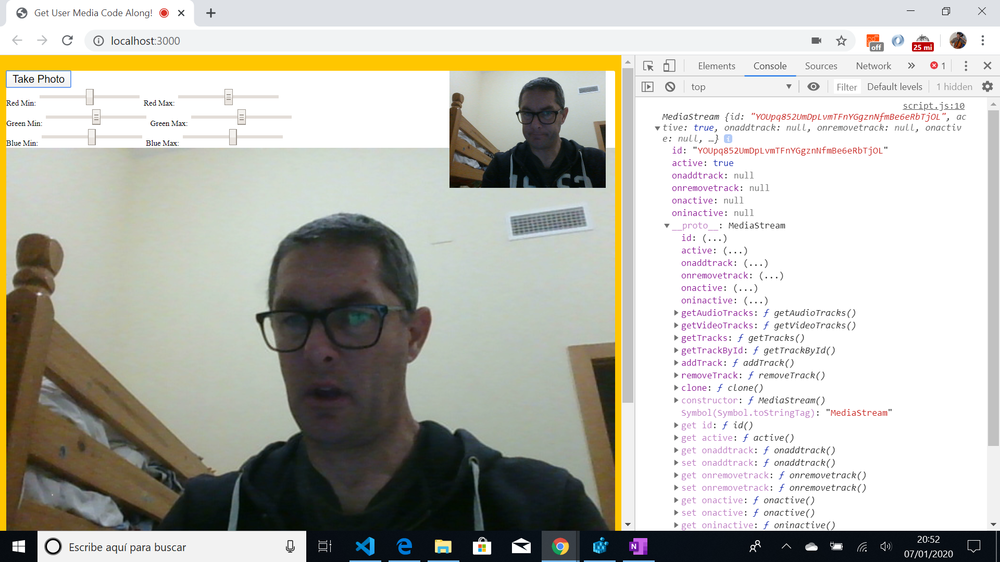
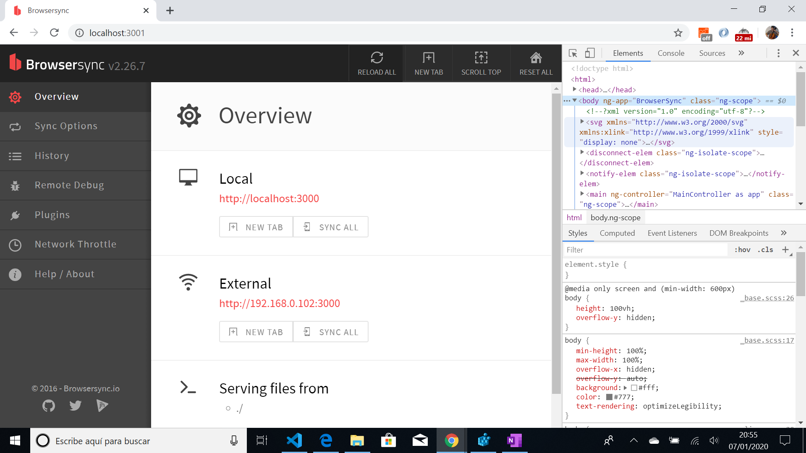

# :zap: Javascript Webcam

Wes Bos Youtube Tutorial: [Unreal Webcam Fun with getUserMedia() and HTML5 Canvas - #JavaScript30 19/30](https://www.youtube.com/watch?v=ElWFcBlVk-o&list=PLu8EoSxDXHP6CGK4YVJhL_VWetA865GOH&index=19).

*** Note: to open web links in a new window use: _ctrl+click on link_**

## :page_facing_up: Table of contents

* [:zap: Javascript Webcam](#zap-javascript-webcam)
  * [:page_facing_up: Table of contents](#page_facing_up-table-of-contents)
  * [:books: General info](#books-general-info)
  * [:camera: Screenshots](#camera-screenshots)
  * [:signal_strength: Technologies](#signal_strength-technologies)
  * [:floppy_disk: Setup](#floppy_disk-setup)
  * [:computer: Code Examples](#computer-code-examples)
  * [:cool: Features](#cool-features)
  * [:clipboard: Status & To-Do List](#clipboard-status--to-do-list)
  * [:clap: Inspiration](#clap-inspiration)
  * [:envelope: Contact](#envelope-contact)

## :books: General info

* Tutorial Code for a webcam in javascript app, using a local server to host the webcam.

## :camera: Screenshots

.
.

## :signal_strength: Technologies

* Ran in Google Chrome browser with: [Javascript engine V8 7.9.317.32 for Windows (x64)](https://v8.dev/).

## :floppy_disk: Setup

* run 'npm i' to install 'browser-sync' package then type 'npm run start'.

## :computer: Code Examples

* function to get video stream data and play it.

```javascript
function getVideo() {
  navigator.mediaDevices.getUserMedia({ video: true, audio_: false })
  .then(localMediaStream => {
    console.log(localMediaStream);
    video.srcObject = localMediaStream;
    video.play();
  })
  .catch(err => {
    console.error(`oh no!!`, err);
  });
}
```

## :cool: Features

* Updated as video.src is deprecated in Chrome Browser: video.srcObject is the new version.

## :clipboard: Status & To-Do List

* Status: Part working. does not take photos as link "http://wesbos.com/demos/photobooth/snap.mp3" does not exist anymore. So photo download just downloads an empty image. Filtering does not work any more.
* To-Do: replace

## :clap: Inspiration

* Wes Bos Youtube Tutorial: [Unreal Webcam Fun with getUserMedia() and HTML5 Canvas - #JavaScript30 19/30](https://www.youtube.com/watch?v=ElWFcBlVk-o&list=PLu8EoSxDXHP6CGK4YVJhL_VWetA865GOH&index=19).

## :envelope: Contact

* Repo created by [ABateman](https://www.andrewbateman.org) - you are welcome to [send me a message](https://andrewbateman.org/contact)
